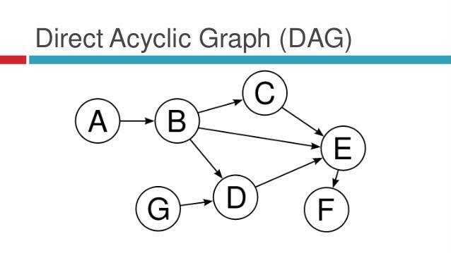

# Golang DAG Like Task Executor



- demo
```go
package taskexecutor

import (
	"context"
	"fmt"
	"testing"
)

func TestExecutor_Execute(t *testing.T) {

	taskList := []Task{
		&TaskA{},
		&TaskB{},
		&TaskD{},
		//&TaskC{},
	}

	var err error
	ctx := context.Background()
	executor := NewExecutor(map[string]Task{"c": &TaskC{}}, 100)

	results := map[string]TaskResult{}
	err = executor.Execute(ctx, taskList, results)
	if err != nil {
		fmt.Println(err)
	}

	for _, v := range results {
		fmt.Printf("%+v\n", v)
	}

	fmt.Println("---------------------------")

	resultChan := make(chan TaskResult, len(taskList))
	err = executor.ExecuteConcurrency(ctx, taskList, resultChan)
	if err != nil {
		fmt.Println(err)
	}

	for x := range resultChan {
		fmt.Printf("%+v\n", x)
	}

	fmt.Println("---------------------------")

	executor.StartPool()
	resultChan2 := make(chan TaskResult, len(taskList))
	err = executor.ExecuteConcurrencyWithPool(ctx, taskList, resultChan2)
	if err != nil {
		fmt.Println(err)
	}

	i := 0
	for x := range resultChan2 {
		i++
		fmt.Printf("%+v\n", x)
		if i >= len(taskList) {
			close(resultChan2)
			break
		}
	}

	executor.StopPool()

}

type TaskA struct {
	TaskBase
}

func (t *TaskA) Name() string {
	return "a"
}

func (t *TaskA) DepNames() []string {
	return []string{"b", "c", "d"}
}

func (t *TaskA) Do(ctx context.Context) (interface{}, error) {
	return "a done", nil
}

type TaskB struct {
	TaskBase
}

func (t *TaskB) Name() string {
	return "b"
}

func (t *TaskB) DepNames() []string {
	return []string{"c", "d"}
}

func (t *TaskB) Do(ctx context.Context) (interface{}, error) {
	return "b done", nil
}

type TaskC struct {
	TaskBase
}

func (t *TaskC) Name() string {
	return "c"
}

func (t *TaskC) DepNames() []string {
	return []string{}
}

func (t *TaskC) Do(ctx context.Context) (interface{}, error) {
	return "c done", nil
}

type TaskD struct {
	TaskBase
}

func (t *TaskD) Name() string {
	return "d"
}

func (t *TaskD) DepNames() []string {
	return []string{"c"}
}

func (t *TaskD) Do(ctx context.Context) (interface{}, error) {
	return "d done", nil
}
```

